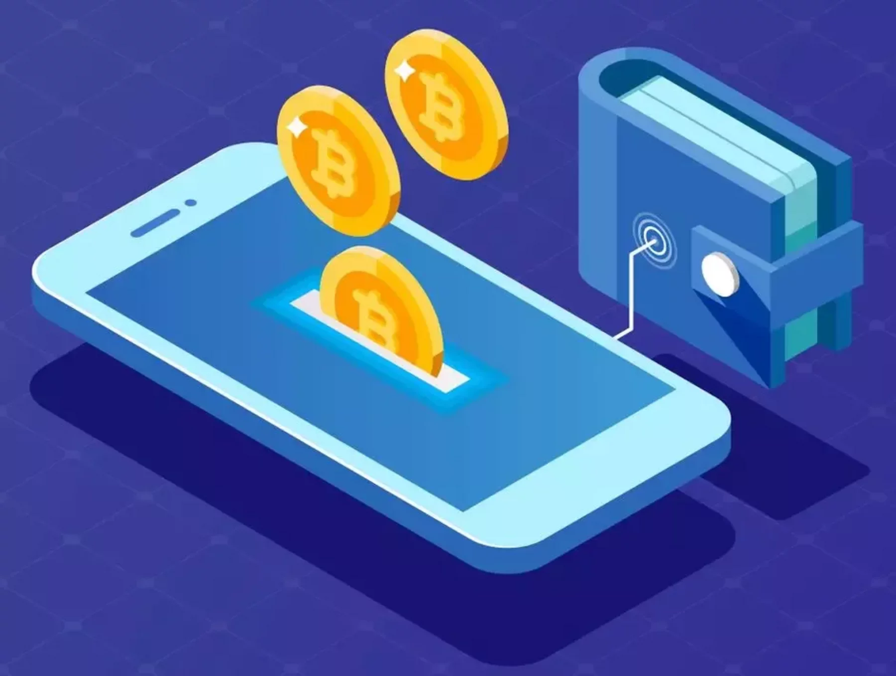

# Digital Wallet

## Case

You were hired as Software Developer to work in a Fintech Company, your job is to develop a Digital Wallet.

## Functional Requirements

- Wallets should be able to transfer money between then
- Every time a transfer was executed, user needs to receive push notification
- User needs to be authenticated to execute a operation 
- User needs to be able to see his transfers (statement)
- It's important to collect metrics to understand user behaviors

## Non Functional Requirements

- The company already have a contract with Cloud Provider
- The Wallet should be able to handle special dates such as Black Friday
- It's important for the company to save money as much possible
